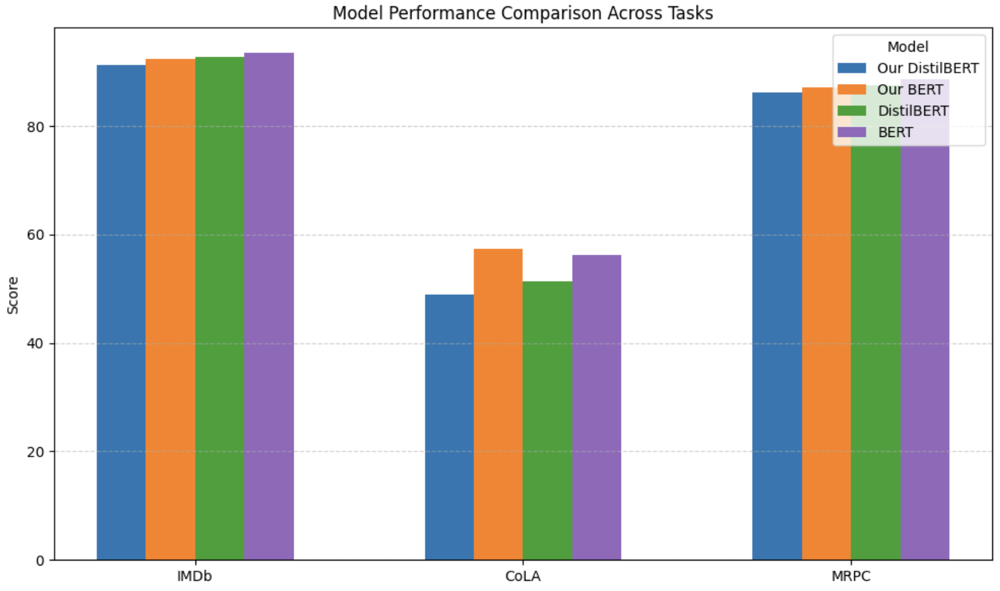

# DistilBERT

## Introduction

The paper “DistilBERT, a distilled version of BERT: smaller, faster, cheaper and lighter” by Victor Sanh, Lysandre Debut, Julien Chaumond, and Thomas Wolf, proposed using knowledge distillation during pretraining to compress BERT models.

Our project replicates this by training and fine-tuning DistilBERT on downstream tasks like sentiment analysis, grammar judgment, and paraphrase detection, retaining 94.35% of BERT's performance across tasks.

## Chosen Result

We aimed to reproduce the results from Table 1 and Table 2 of the paper, which demonstrate that DistilBERT retains most of BERT's performance on classification and GLUE Benchmark tasks. We focused evaluating the model's performance on on CoLA, MRPC, and IMDb tasks.

## GitHub Contents

**code/** contains our final training notebook, a requirements.txt, and a folder containing notebooks we used to run preliminary experiments on before training our final models. Within the experiments folder, we experimented with pretraining a DistilBERT model and evaluating it on a downstream task (cola_pretrain_eval.ipynb and imdb_pretrain_eval.ipynb) as well as doing a simple task-specific distillation (mrpc_task_distillation_eval.ipynb and imdb_task_distillation_eval.ipynb).

**data/** contains a README.md citing the sources of, explaining, and showing how to use our datasets

**poster/** contains the PDF file of our poster

**report/** contains the PDF file of our final report, which entails more details about the project

**results/** contains the figures and tables generated by our code. The top level figures and models represent the results from our final training. Each downstream task folder (i.e. imdb_final_finetune has it's own set of figures for evaluation). Experimental results and models can be found under experiment_results/ organized by the experiment corresponding to its code/ notebook. !! NOTE: Some results aggregated across tasks can only be found in the distilbert_final.ipynb !!

## Re-implementation Details

To reproduce the results of the paper, we followed the knowledge distillation approach from the paper paper. We used the pretrained uncased BERT as the teacher model and DistilBERT as the student model. We reinitialized the student model layers by taking every other layer from the teacher model and removing the token-type embeddings and poolers.

The models were trained for 10 epochs on the wikitext dataset with a masked language modeling (MLM) task using a triple loss objective: MLM Loss, KL-Divergence Loss, and Cosine Embedding Loss. We ran the model on Colab free T4 GPUs, and fine-tuned it on downstream tasks such as CoLA, MRPC, and IMDb.

Challenges included the limited computational resources available on Colab but the approach followed the original paper's methodology, ensuring consistency in the distillation process.

## Reproduction Steps

To run our code, download the desired file from /code and import them to Google Colab. Before running the notebook, switch the Runtime Type to T4 GPU.

!! NOTE: Most notebooks rely on hardcoded save paths that correspond to our file structure to save models and generate figures. You will likely have to edit these so that folder names / directories will be compatible with your environment. !!

## Results/Insights

Our reimplementation produces results that are very similar to the original paper's results.

Our DistilBERT retained 94.35% of the BERT model's performance, while the paper's DistilBERt retained 97% of BERT's performance.

## Conclusion

Knowledge-distilled models are more accessible, environmentally sustainable, resource efficient, and equally as effective as large models.

## References

Papers:

- Sanh, V., Debut, L., Chaumond, J., & Wolf, T. (2019). DistilBERT, a distilled version of BERT: smaller, faster, cheaper and lighter. arXiv. https://arxiv.org/abs/1910.01108
- Wang, A., Singh, A., Michael, J., Hill, F., Levy, O., & Bowman, S. R. (2019). GLUE: A Multi-Task Benchmark and Analysis Platform for Natural Language Understanding. arXiv. https://arxiv.org/abs/1804.07461

Tools and Frameworks:

- Wolf, T., Debut, L., Sanh, V., Chaumond, J., Delangue, C., Moi, A., ... & Rush, A. M. (2020). Transformers: State-of-the-art Natural Language Processing. Proceedings of the 2020 Conference on Empirical Methods in Natural Language Processing: System Demonstrations, 38–45. https://doi.org/10.18653/v1/2020.emnlp-demos.6
- Paszke, A., Gross, S., Massa, F., Lerer, A., Bradbury, J., Chanan, G., ... & Chintala, S. (2019). PyTorch: An imperative style, high-performance deep learning library. Advances in Neural Information Processing Systems, 32, 8026–8037. https://papers.nips.cc/paper_files/paper/2019/hash/bdbca288fee7f92f2bfa9f7012727740-Abstract.html

Datasets:

- Merity, S., Xiong, C., Bradbury, J., & Socher, R. (2016). Pointer Sentinel Mixture Models. arXiv. https://arxiv.org/abs/1609.07843 (for WikiText-2)
- Socher, R., Perelygin, A., Wu, J. Y., Chuang, J., Manning, C. D., Ng, A. Y., & Potts, C. (2013). Recursive Deep Models for Semantic Compositionality Over a Sentiment Treebank. Proceedings of the 2013 Conference on Empirical Methods in Natural Language Processing, 1631–1642. (for IMDb)
- Dolan, W. B., & Brockett, C. (2005). Automatically constructing a corpus of sentential paraphrases. Proceedings of the Third International Workshop on Paraphrasing (IWP2005). (for MRPC)
- Warstadt, A., Singh, A., & Bowman, S. R. (2019). Neural Network Acceptability Judgments. Transactions of the Association for Computational Linguistics, 7, 625–641. https://aclanthology.org/Q19-1042/ (for CoLA)

## Acknowledgments

We would like to thank CS 4782 for providing the resources that enabled us to complete this project. We also acknowledge the collaborative efforts of our team members: Daniel Botros, Jenny Chen, Jessica Cho, Eric Gao, and Xinyu Ge, whose contributions were essential in completing this project.
